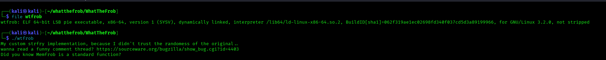
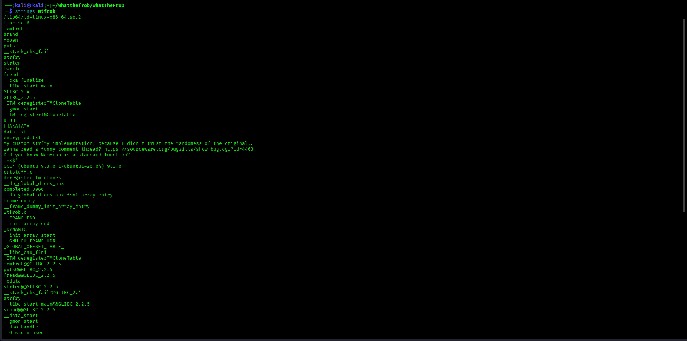
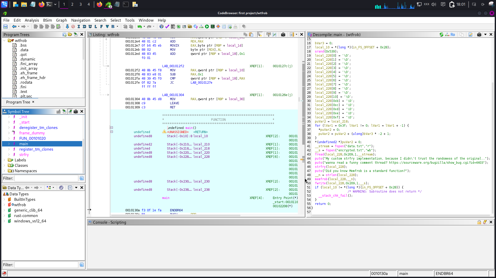
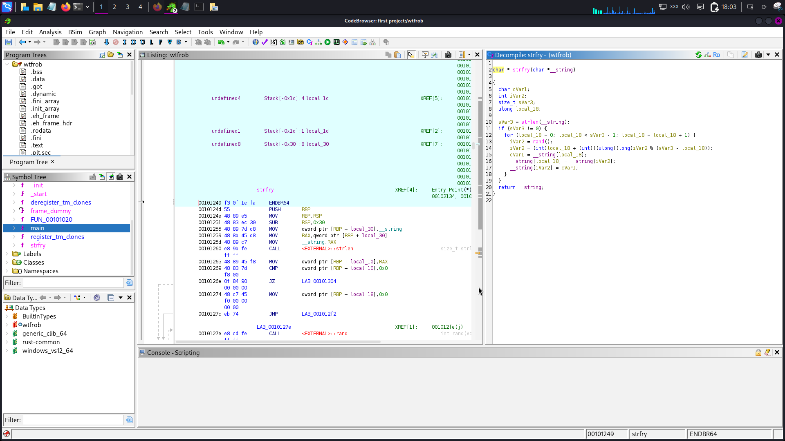
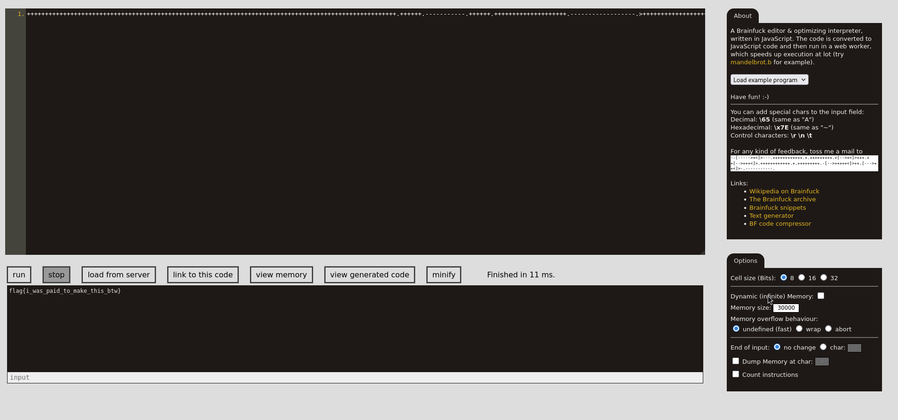
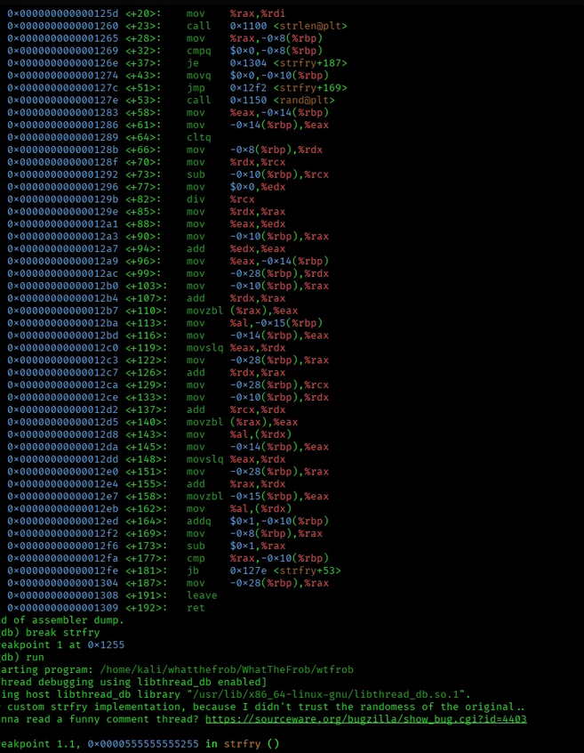
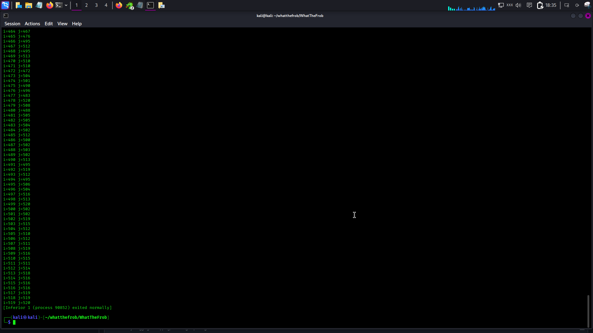

# WhattheFrob? — CTF Writeup

**Challenge:** WhattheFrob? (reverse engineering / cryptography)

**Objective:** The goal of this challenge was to understand how the wtfrob binary hides the original data. I needed to analyze the obfuscation process, reverse the operations, and understand the hidden payload to recover the final flag.

### Core Technical challenge
* **Understanding the Obfuscation Process**: The first step was to analyze the custom strfry implementation. The program used a fixed random seed of 1337, which means the shuffle was predictable. Because the same seed always produces the same sequence, I was able to reproduce and reverse the shuffle.
* **Reversing the XOR and Shuffle**: The program also used memfrob, which applies an XOR operation using the value 0x2A. Since XOR is reversible, applying the same operation again restores the original data.
To fully recover the payload, I also had to reverse the array swaps in the opposite order from how they were originally applied.
* **Understanding the Hidden Payload**: After reversing the obfuscation, I recovered a 521-byte payload. The payload turned out to be Brainfuck source code. I then ran the code through a Brainfuck interpreter, which revealed the final flag:
---

## 1. Initial Recon





Two glibc joke functions are in play:

- **`memfrob(buf, n)`** — XORs every byte of `buf[0..n-1]` with the constant `0x2A`.
  Self-inverse: applying it twice returns the original data.
- **`strfry(str)`** — normally an in-place Fisher–Yates shuffle of a string using `rand()`.
  

Since the binary is not stripped and retains source-level line info (`wtfrob.c`,
`strfry.c` show up under `strings`), Ghidra can decompile it with real symbol names.

---

## 2. Static Analysis (Ghidra)



### `main()`

```c
srand(0x539);                            // fixed seed = 1337, NOT time-based

__stream = fopen("data.txt", "r");
__s      = fopen("encrypted.txt", "wb");

fread(local_228, 0x209, 1, __stream);    // read up to 521 bytes of plaintext

strfry(local_228);                       // custom shuffle

__n = strlen(local_228);                 // length measured AFTER shuffling
memfrob(local_228, __n);                 // XOR first __n bytes with 0x2A

fwrite(local_228, 0x209, 1, __s);        // write the FULL 521-byte buffer
```

Key details:

- The seed used in the program is a hardcoded value, 0x539, which is equal to 1337. It does not use time(NULL), so the shuffle is always predictable and produces the same result every time.
- The buffer is initialized with zeros before fread() is used. Because of this, any part of the buffer that is not filled with actual file data remains 0x00.
- The program uses strlen() after the shuffle, but the length stays the same as before the shuffle because the null terminator is not moved during the shuffle process.
- The program writes the entire 521-byte buffer to the output file, even if the actual data is smaller. Because of this, encrypted.txt is always exactly 521 bytes.
  
### `strfry()`



The program uses a Fisher–Yates shuffle. The loop only accesses indices from 0 to sVar3 - 1, so it never changes the value at index sVar3, where the null terminator is located. Because of this, the position of the null terminator stays the same even after the shuffle.

### Why it's reversible

- Using the same seed always produces the same rand() sequence, so the shuffle can be reproduced.
- Since the data is shuffled using a series of swaps, the original order can be restored by applying the same swaps in reverse order.
- memfrob is also easy to reverse because XOR is self-inverse. Applying the same XOR operation again restores the original data.

The main unknown is sVar3, which represents the original length of the data. Since the program does not print or store this value anywhere, it has to be determined by analyzing the ciphertext.

---

## 3. Solve Method A — Python (static replay)

if we want the fastest method we can solve is to
replay glibc's real `rand()` via `ctypes` (bit-exact, since it calls the actual libc,
not a reimplementation) and brute-force the unknown length `n`:

```python
import ctypes
libc = ctypes.CDLL("libc.so.6")

def gen_swaps(seed, n):
    libc.srand(seed)
    swaps = []
    for i in range(n - 1):
        r = libc.rand()
        j = i + (r % (n - i))
        swaps.append((i, j))
    return swaps

def unshuffle(buf, swaps):
    buf = bytearray(buf)
    for i, j in reversed(swaps):        # undo in REVERSE order
        buf[i], buf[j] = buf[j], buf[i]
    return bytes(buf)

with open("encrypted.txt", "rb") as f:
    enc = f.read()

for n in range(1, len(enc) + 1):
    if any(b != 0 for b in enc[n:]):        # tail must be untouched zero padding
        continue
    mem_undone = bytes(b ^ 0x2A for b in enc[:n])   # undo memfrob
    swaps = gen_swaps(1337, n)
    recovered = unshuffle(mem_undone, swaps)         # undo strfry
    printable = sum(32 <= c < 127 for c in recovered) / max(len(recovered), 1)
    if printable > 0.9:
        print(n, recovered)
```
```
python3 solve.py

[*] encrypted.txt is 521 bytes
[+] candidate length n=521
    recovered: b'++++++++++++++++++++++++++++++++++++++++++++++++++++++++++++++++++++++++++++++++++++++++++++++++++++++.++++++.-----------.++++++.++++++++++++++++++++.------------------.>+++++++++++++++++++++++++++++++++++++++++++++++++++++++++++++++++++++++++++++++++++++++++++++++.<++++++++++++++.----------------------.++++++++++++++++++.>.<---.---------------.++++++++.-----.>.<++++++++++++++++.-----.>.<--.------------.++++++++++.------.>.<+++++++++++++++.------------.+.++++++++++.>.<-----------------.++++++++++++++++++.+++.++++++.'
```


**Result:** `n = 521`, recovered plaintext is **Brainfuck source code** (not the flag
directly — the challenge author hid a Brainfuck program as the "plaintext"). Running it
through any Brainfuck interpreter outputs the flag:


```
flag{i_was_paid_to_make_this_btw}
```

---

## 4. Solve Method B — Dynamic Analysis (GDB, no PRNG reimplementation)

Instead of writing scripts `ctypes` call matches the binary's PRNG output
exactly, GDB can read the actual swap values the *running process* computes.


### Finding the right offset

From the disassembly of `strfry`:


```
<+90>: mov -0x10(%rbp),%eax        ; i
<+94>: add %edx,%eax               ; eax = i + (r % (n-i)) = j
<+96>: mov %eax,-0x14(%rbp)        ; store j
<+99>: mov -0x28(%rbp),%rdx        ; <-- breakpoint here: %eax still holds j
...
<+164>: addq $0x1,-0x10(%rbp)      ; i++  (confirms i lives at -0x10(%rbp))
```


### GDB session

```
gdb ./wtfrob
(gdb) break *strfry+99
(gdb) commands
> silent
> printf "i=%d j=%d\n", *(int*)($rbp-0x10), $eax
> continue
> end
(gdb) set logging file swaps2.log
(gdb) set logging enabled on
(gdb) run
```

This produces `swaps2.log` with all 520 `(i, j)` pairs, e.g.:

```
i=0 j=157
i=1 j=423
i=2 j=300
...
```

### Reversing using only the log (no `rand()` replay needed)

```python
with open("encrypted.txt", "rb") as f:
    data = bytearray(f.read())

n = 521
for i in range(n):
    data[i] ^= 0x2A                       # undo memfrob

swaps = []
with open("swaps2.log") as f:
    for line in f:
        if line.startswith("i="):
            i, j = (int(x) for x in line.replace("i=", "").replace("j=", "").split())
            swaps.append((i, j))

for i, j in reversed(swaps):              # undo in reverse order
    data[i], data[j] = data[j], data[i]

with open("data_recovered_gdb.txt", "wb") as f:
    f.write(data)
```
**flag{i_was_paid_to_make_this_btw}**

both result is the same

---


## Lessons Learned

This challenge taught me some important lessons about both secure programming and reverse engineering.

### 1. Obfuscation Is Not Encryption
* **I learned that simple techniques like memfrob (XOR 42) or string scrambling with strfry do not actually secure data. They may make the program harder to understand at first, but someone who analyzes the binary can still reverse them.
For real security, developers should use trusted encryption algorithms such as AES or ChaCha20 instead of relying on simple obfuscation techniques.**

### 2. Predictable Random Values Can Be a Security Problem
* **I also learned that functions like rand() and srand() are not truly random. They produce predictable results based on the seed value. If someone knows or can guess the seed, they may be able to reproduce all the values generated by the program.
For security-related operations, developers should use cryptographically secure random number generators such as getrandom() instead.**

### 3. Always Validate Input and Parameters
* **The wtfrob binary crashed with a segmentation fault because it tried to use a missing file argument without checking it first. This showed me how important input validation is.
Developers should always check pointers, files, and other external inputs before using them. For example, checking for NULL values can help prevent crashes and unexpected behavior.**

### 4. Dynamic Analysis Can Make Reverse Engineering Easier
* **Trying to understand complex calculations or custom array operations only by reading the code can take a lot of time. During reverse engineering, dynamic analysis can sometimes make the process easier.
Tools like GDB can be used to observe the program while it is running, inspect registers, and examine memory. This can help understand what the program is doing without having to manually follow every part of the logic.**
